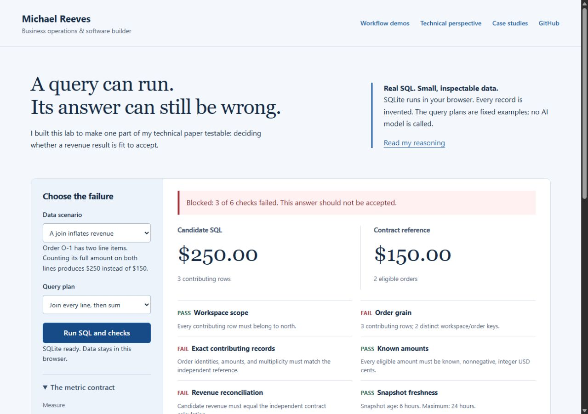

# Michael Reeves — Application workbench

I come from sales and operations, where incomplete data and repetitive workflows create practical software problems. This repository contains my application portfolio: an executable SQL reliability lab, three workflow demos, case studies, and my technical perspective for Dreambase.

[Live portfolio](https://vex707.github.io/dreambase-application/) · [SQL lab](https://vex707.github.io/dreambase-application/metric-lab.html) · [Technical paper](https://vex707.github.io/dreambase-application/technical.html) · [Walkthrough](https://vex707.github.io/dreambase-application/walkthrough.html)

I built these application editions with AI coding assistance and synthetic data. The SQL lab executes real queries. The showroom audit is explicitly a response replay, with no live model call. My [provenance notes](docs/about-this-work.md) explain which work is new and how it relates to my existing projects.



## Run

Requires Node.js 20 or later. No API key or database service is needed. Install the pinned SQL engine to run the tests and evaluations:

```powershell
npm ci --ignore-scripts
npm test
npm run evaluate
npm start
```

Open http://127.0.0.1:4173. The server exposes only `site/`, not the workspace root. Stop it with Ctrl+C. The application also works on a static host that supports JavaScript modules.

The browser runtime is vendored, so `npm start` alone is enough to view the site. To reproduce those assets from the lockfile, run `npm run vendor`. See [third-party notices](THIRD-PARTY-NOTICES.md).

## Demonstrations

| Workflow | What runs | What is not demonstrated |
|---|---|---|
| Metric Reliability Lab | Real SQLite, independent reference calculation, six contract checks, downloadable evidence | Arbitrary generated SQL, live agents, production authorization or sandboxing |
| Customer report to labels | CSV parsing, address completeness, duplicates, printable 30-up layout | Postal deliverability, arbitrary report formats, physical printer calibration |
| Homeowner prospecting | Synthetic record filtering, date windows, deduplication, safe CSV export | Live data retrieval or provider availability |
| AI audit review | Runtime contract validation, rejection, review routing | A model call, image recognition accuracy, production agent orchestration |

I created the standalone report-label demo for this application; the original labeler is not included. My homeowner source version uses Redfin/Zillow, and my audit source version uses Anthropic. References to RentCast and Gemini in my older resume describe different versions of those projects.

## Read

- [My business: Web Apps with Michael](https://vex707.github.io/dreambase-application/my-business.html)
- [Case studies](docs/case-studies.md)
- [Technical perspective](docs/technical-deep-dive.md)
- [Provenance and AI assistance](docs/about-this-work.md)
- [Walkthrough script and recording instructions](docs/walkthrough-script.md)
- [Interview preparation](docs/interview-preparation.md)
- [Publishing instructions](docs/publishing.md)

## Structure

- `site/`: public portfolio and runnable browser workbench.
- `site/lib/`: testable deterministic business rules.
- `site/data/`: invented fixtures, not customer or employer data.
- `tests/`: Node domain tests.
- `scripts/`: local preview and artifact preparation.
- `docs/`: case studies, proposal, preparation and verification notes.
- `github-profile/`: proposed profile README; not automatically installed.
- `private/`: ignored email, resume, profile drafts and source notes.
- `output/`: ignored generated PDFs and video.

## Authorship and evidence

I use AI tools for code, tests, research, writing, and application preparation. My engineering skills are still developing; these work samples show the problems and decisions I am working through. I have not included workplace images or customer data in this repository.

## Follow one result through the code

1. `site/lib/metric-lab.mjs` defines a versioned contract, synthetic fixtures, and fixed SQL plans.
2. SQLite executes a candidate query with bound parameters.
3. A separate JavaScript reference calculation selects the expected order records.
4. Six checks decide acceptance: workspace scope, unique order grain, exact records, known amounts, reconciled revenue, and snapshot freshness.
5. `site/metric-lab.mjs` presents the result and exports its evidence receipt.

`npm run evaluate` writes `output/evaluations/metric-lab.json`. Its nine fixed cases include both expected acceptances and expected rejections. These are reproducible synthetic results, not a model-quality or performance benchmark.

## Rebuild written pages

Generated HTML is committed so the demos require no tooling installation. `scripts/build-pages.mjs` uses the `marked` package only for authoring. Set `CODEX_NODE_MODULES` to the bundled runtime's package path in Codex, or install `marked` in a separate authoring environment, then run `node scripts/build-pages.mjs`.

## Scope

This is an application work sample, with a local-only preview server. It does not include authentication, provider billing controls, persistent customer storage, mail sending, or production deployment claims. Do not add real customer data to a public deployment.
